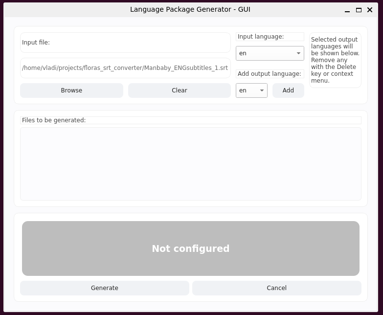
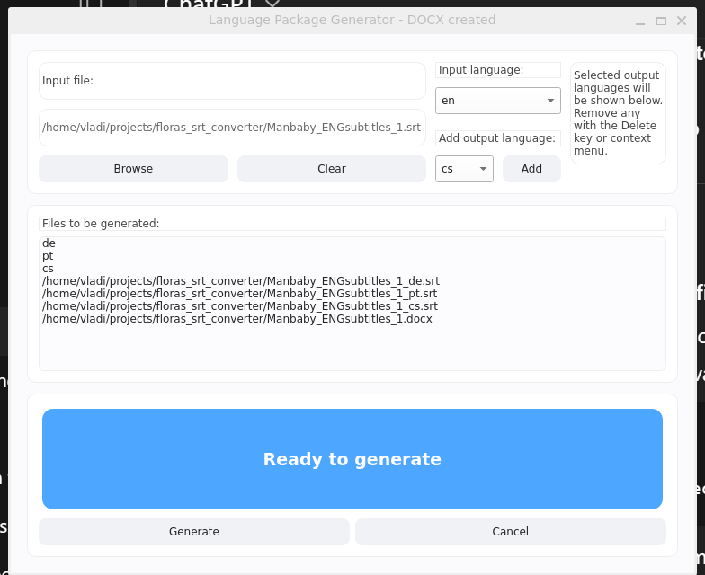
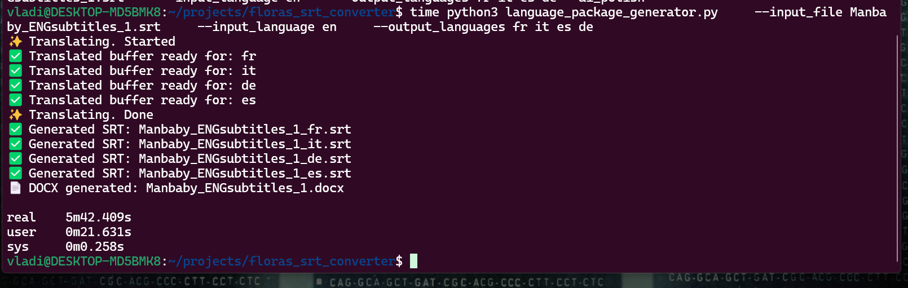

# Subtitle Language Package Generator

This collection of python scripts represents a language package generator based on input srt file. It will generate srt file for each of the languages selected and a docx table with timestamps, selected languages and input language as columns.

## Dependencies

- [Install Python](https://www.python.org/downloads/)
- Once Python is installed, install the required Python packages:

```bash
pip install -r requirements.txt
```

* * *

## Running with the GUI (Recommended)

The project includes a modern, user-friendly GUI built with PySide6 for easy operation.

### Launch:

1.  Ensure all dependencies are installed.
2.  Launch the GUI:

```bash
python ui/main_window.py
```

### Use the interface

1.  Initial State is Not Configured   
    
2.  Choose the input language
3.  Add one or more output languages
4.  One configured the button will indicate its ready  
    
5.  When running   
    
6.  Click **Generate** to produce translated SRT and DOCX files.

> 🟢 The State button changes color to indicate processing status:
> 
> - Gray: Waiting for input
> - Blue: Ready to run
> - Red: Running translations
> - Orange: Finishing up
> - Green: Complete

* * *

## Running via Command Line Interface (CLI)

The script can also be executed directly from the command line.  


### Example usage:

```bash
python language_package_generator.py --input_file input.srt --input_language en --output_languages fr it es de
```

- `--input_file`: Path to the original subtitle file (SRT).
- `--input_language`: Language of the input file (e.g., `en`).
- `--output_languages`: One or more language codes (e.g., `fr it es de`).

This will generate:

- Multiple translated `.srt` files.
- One `.docx` file containing all translations in separate columns.

* * *

## Notes

- GUI runs on Windows, macOS, and Linux (including WSL).
- Output files are stored in the same directory as the input file unless specified otherwise.

* * *

## 📄 License

This project is released under the MIT License.